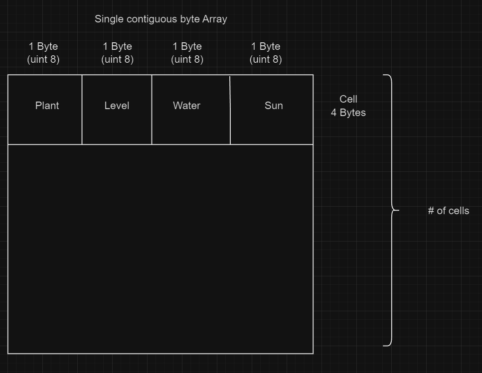

# Devlog Entry - 11/19/23

## Intoducing the Team

- Tools Lead - Aaron Lee
- Engine Lead - Jonathan Alvarez
- Design Lead - Gyle Viloria
- Assistant - Wichapas Pichetpongsa
- Backup - Nhan Nguyen

## Tools and Materials

- For our engine, we decided to use Phaser 3 because it is an engine that every member is familiar with and it uses js/ts. With the game being grid-based, it would seem easy to use Phaser 3 to keep things simple skipping the need of using an engine that supports 3d graphics. CMPM 120 was everyone's first run-in with Phaser and after having used it back then + our newfound knowledge of js/ts it only seemed natural that we would use Phaser. Since the team has a decent level of familiarity with Phaser we thought this was the best plan to be able to adapt to any assignment requirements added throughout the project.

- We decided to use either Typescript or Javascript because we can use what was taught in class and everyone in the group would have similar familiarity with the language. Also, Typescript having "interface" is something we feel like might come in handy.

- We most likely will be using VSCode for our IDE. This is due to our familiarity with the IDE and everybody is on the same page.

## Outlook

- The hardest/riskiest part of the project is how we chose Phaser but if we don't feel like it fits the requirements we might have to change the framework in the future.

# Devlog Entry - 11/29/23

## How we satisfied the software requirements

For our game, we have a controllable player on a 3x3 grid where any action-- moving, reaping, sowing-- will advance time by 1 day. Each cell has its own amount of sun energy and water level each day. At the beginning of the game, all grid cells are populated randomly by one of two plant types: **Flowers** and **Tomato Trees**. Both of these plant types have three levels of growth and require at least 1 sun energy, but **Flowers** need at least 1 level of water while **Tomato Trees** need at least 2 levels of water. Once plants reach growth level 3, players can reap them by pressing Space while on the same cell. For a cell without a plant, players can sow a random plant by pressing Space. For the win condition of the game we decided on a simple condition of collecting ten plants to show a win message. This may get changed in the future but we have this as a placeholder for now.

## Reflection

For our initial implementation, we decided to not use Phaser 3. It has a lot of functionality, but with our current implementation, it was much more lightweight to work without it. We are going forward with using just JavaScript (TypeScript) for now. Interfaces and type aliases have been helpful for us, and our familiarity with TypeScript made it much easier for the team to understand and read each other's code.

# Devlog Entry - 12/5/23

## How we satisfied the software requirements

- F0.a - F0.g: Same as last week

- F1.a: We used an Array of Structures to format our cell data. Each cell is represented as a 4-byte array, with each byte representing a different piece of information for that cell. Memory is statically allocated for the entire grid (based on the number of cells).
  - The first byte contains the Plant type.
  - The second byte contains the Growth Level.
  - The third byte contains the Water Level.
  - The fourth byte contains the Sun Level.

- F1.b: We have arrays `logs` and `redos` that both hold `gameStates`, which contain the important information of each day of the game. The player is able to undo (R) and redo (T) every action multiple times, even from a saved game.
- F1.c: Players can save their data on three different slots by pressing **1**, **2**, and **3**. They can then load their save file by pressing **Shift + 1/2/3** for the respective slot.
- F1.d: After each move that the player makes, the game is auto-saved into an auto-save entry. In the case of an unexpected quit, the player is prompted if they want to "load from autosave" when they re-enter the game.

## Reflection

After switching to just TypeScript (with no Phaser library), not much has changed for our team plan. For now, we are continuing to build upon our code from last week and adding the new software requirements from F1. We will need to pick up the pace for these next assignments, which will reduce our scope in terms of gameplay mechanics.

# Devlog Entry - 12/7/23

## How we satisfied the software requirements

### F0+F1

- Most of the code from F0+F1 was left untouched. At first, we were passing 3x3 to our constructor and the goal was 10 plants by default in the previous step. However, with the addition of External/Internal DSL we changed what was being passed to the constructor and rendering. This change essentially changed no code funcitonality but the result was that we can now add/remove game levels and rules by editting these DSL's.

### External DSL for Scenario Design

For our external DSL, we decided to use the pre-existing DSL called JSON. We chose this language because it is something we're familiar to and also used it has been used in a previous class called CMPM 120.

~~~JSON
[
  {
    "rows": 3,
    "cols": 3,
    "goal": [5, 5],
    "start": [2023, 0, 1]
  },
]
~~~

- In the file called levels.json, it is used for changing row, column, goal, and date values. This file is intended for changing the game's level once the player has reached the goal. We have a row and column definition because we want to change the grid size to open more possibilities for the player. Next, we have a goal for checking when the player wins and the date to let the player know how much time has passed.

### Internal DSL for Scenario Design

~~~TS
function InternalPlantTypeCompiler (program: ($: PlantDefinitionLanguage) => void): 
InternalPlantType{
  const internalPlantType = new InternalPlantType();
  const dsl: PlantDefinitionLanguage = {
    type(type: PlantType): void {
      internalPlantType.type = type
    },
    assets(assets: string[]): void {
      internalPlantType.assets = assets;
    },
    sun(sun: number): void {
      internalPlantType.sun = sun;
    }
  };
  program(dsl);
  return internalPlantType;
}
~~~

~~~TS

const allPlantDefinitions = [
      function flower($: PlantDefinitionLanguage) {
        $.type(PlantType.Type1);
        $.assets([
          "assets/type1_level1.png",
          "assets/type1_level2.png",
          "assets/type1_level3.png",
        ]);
        $.sun(1);
~~~

~~~TS
this.plants = allPlantDefinitions.map(InternalPlantTypeCompiler);
~~~

- This was written in TypeScript. In the code snippets above, we basically implemented a subclass sandbox pattern. In a more natural language explanation, each variant or type of an object is represented by a separate subclass. The key idea is to encapsulate the behavior of each type within its own class, creating a sandbox-like environment for managing the variations. We had PlantDefinitionLanguage interface to let different plant types share the same function names but how they are implemented is different based on their types.

## Reflection
Our plan has changed slightly now that we have multiple levels because the saving functionality broke. So, our solution was to clear the game save everytime we move on to the next level. Autosave will feature will only work on the level you're currently on. Also, we started thinking more about polishing our game to be more enjoyable for the player. Our game was on point with the requirements but did not account to the essence of the game being fun for the player. We updated the visual representation of water and the tiles to be understood easier. In the previous versions, we found the increasing images of water as water level increases is extremely annoying so we came up with the idea to just have an image and a number represent the levels instead. In total, a bunch of quality of life and aesthetic changes.

# Devlog Entry - 12/9/23

## How we satisfied the software requirements

### F0+F1+F2

- The code from our F0+F1+F2 sections have remained unchanged. Even after when we add internalization and localization to our program, which added 2 additional languages: chinese, arabic. These changes doesn't affect what has already worked for F0+F1+F2 requirements as the code changes are all new additions.

### Internationalization

What we changed to prepare for internationalization was go from using "strings" to now using a system that pulls from a list of pre translated phrases. To add a new phrase what needs to be updated is the languageData interface that defines what phrases should be in the data that is parsed in.

~~~ts
interface LanguageData {
  load: string;
  win: string;
  save: string;
  slot1: string;
  slot2: string;
  slot3: string;
  inventory: string;
  dateCode: string;
  autoSave: string;
  controls: string;
  nextLevel: string;
  end: string;
  info: string;
  saveButtons: string;
  playerButtons: string;
}
~~~

each language that we add has its own JSON file that holds the data of the translated version of the text that we originally had in english

~~~JSON
{
    "load": "loaded from ",
    "win" :  "You win!",
    "save" : "saved to ",
    "slot1" : "slot 1",
    "slot2" : "slot 2",
    "slot3" : "slot 3",
    "inventory" : "Inventory:",
    "dateCode" : "en-US",
    "autoSave" : "Load from autosave?",
    "controls": "Controls:  <b>↑/↓/←/→/Swipe</b>: Move Player  <b>Space</b>: Reap / Sow on Current Tile  <b>R/T</b>: Undo / Redo  <b>1/2/3</b>: Save Game Into Slot 1/2/3 <b>Shift + 1/2/3</b>: Load Game From Slot 1/2/3 ",
    "nextLevel" : "Do you want to go to the next level?",
    "end" : "You finished the last level and beat the game.",
    "info" : "Controls + Save States",
    "saveButtons": " <button id=\"savebtn1\">save 1</button><button id=\"savebtn2\">save 2</button><button id=\"savebtn3\">save 3</button> <button id=\"loadbtn1\">load 1</button><button id=\"loadbtn2\">load 2</button><button id=\"loadbtn3\">load 3</button>",
    "playerButtons": "<button id=\"playerAction\">Reap/Sow</button><button id=\"undobtn\">undo</button><button id=\"redobtn\">redo</button>"

}
~~~

To add a new language you would add a new file languageName.JSON and fill out the required phrases. then At the top of test.ts you would add one line to parse it in.

~~~ts
const englishData = JSON.parse(JSON.stringify(english)) as LanguageData;
const chineseData = JSON.parse(JSON.stringify(chinese)) as LanguageData;
const arabicData = JSON.parse(JSON.stringify(arabic)) as LanguageData;
~~~

an HTML button will be made for that langugage and an event listener to go along to change the language. The languageData is then held in the Game class that holds all the info for the game and it will place the phrases where they belong.

### Localization

## Languages

- English

  We chose english since everyone in our group can speak it and our main audience is everyone in this class who should be proficient in reading this language

- Logographic language - Chinese

  We chose chinese to fufill this requirement because our tools lead can read chinese and help us with the requirement. This way we dont have to hope that
Google Translate is giving us the most faithful translation that conveys our game text correctly.

- Right-to-left script language - Arabic

  When picking a language for this requirement we were mainly looking at Hebrew or Arabic. Both of these langauges provided similar challenges and we just ended up
going with arabic for no particular reason. Since none of us speak this language this was a chatGPT moment  where I would paste the phrase in english and then tell it to translate into arabic. That worked pretty well and I was able to paste my whole english JSON file and have it translate the whole thing and spit out an identical JSON file only now translated to arabic.

The version of the game that we shipped has all three languages that are listed above with the player changing the current language with a button. The language buttons are always shown on the screen so the player can change the language at will.

### Mobile Installation

To get our game playable on a mobile device we followed the Capacitor link that was given to us on the F3 Software requirements page. No changes were needed in terms of our code but there was a change that needed to be made to our build script to ensure that all our files bundled correctly for the app. We chose to only create an android app because the platform allows you to sideload apps from .apk files unlike on an apple device.

Links used

- [Getting Started With Capcitor](<https://capacitorjs.com/docs/getting-started>)
- [Capacitor Android Documentation](<https://capacitorjs.com/docs/android>)
- [Troubleshooting Android Issues in Capacitor](<https://capacitorjs.com/docs/android/troubleshooting>)

### Mobile Play (Offline)

No changes in our design were required to play our game offline. Our never needed an internet connection besides the fact that it was played in a browser, but now that its packaged in an app using capacitor the game works perfectly offline.

## Reflection

- When adding the game to mobile, we had to do a lot of reconsiderations for our current controls since our current controls doesn't work well when it comes to mobile devices like phones and tablet. As a result, started out as a purely keyboard-based game, we have made the decision to add touch controls to the game and also manual buttons. Ultimately, our game evolved in a way that allow players to have multiple ways playing the game that fits their style. For example, 1 player could be using the keyboard while using the sow/reap button, one player could be using the keyboard while pressing the spacebar (button to sow/reap), or one player could even hook up a bluetooth keyboard to their mobile device and using the spacebar and swipe motions for movement
